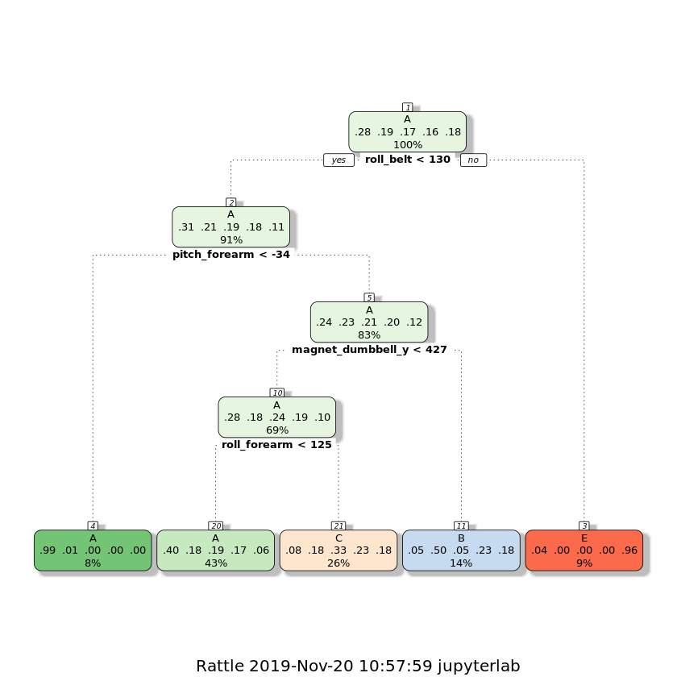
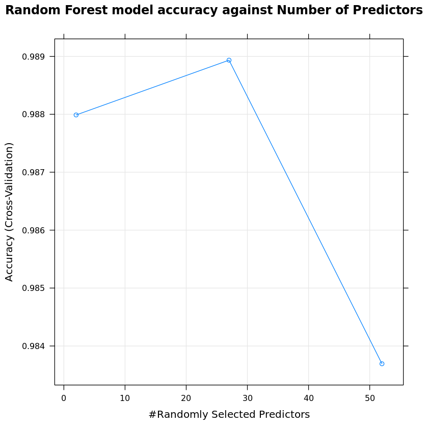
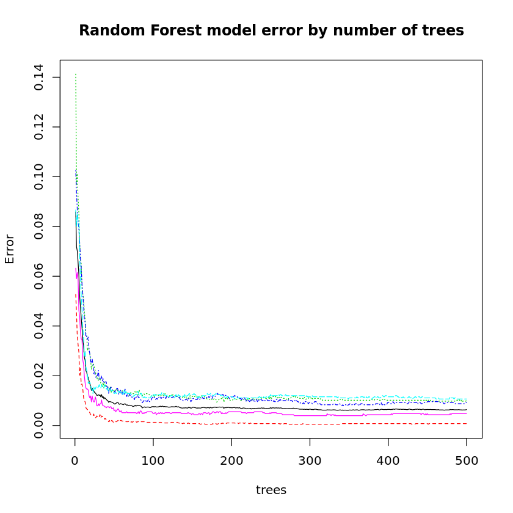
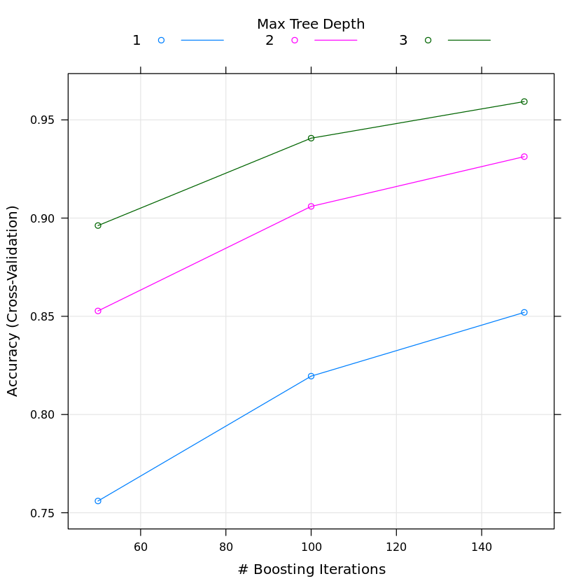

# Coursera - Practical Machine Learning Project
### by Ramesh NBN

## Introduction and Background

Using devices such as Jawbone Up, Nike FuelBand, and Fitbit it is now possible to collect a large amount of data about personal activity relatively inexpensively. These type of devices are part of the quantified self movement – a group of enthusiasts who take measurements about themselves regularly to improve their health, to find patterns in their behavior, or because they are tech geeks. One thing that people regularly do is quantify how much of a particular activity they do, but they rarely quantify how well they do it. In this project, your goal will be to use data from accelerometers on the belt, forearm, arm, and dumbell of 6 participants. They were asked to perform barbell lifts correctly and incorrectly in 5 different ways. More information is available from the website here: http://web.archive.org/web/20161224072740/http:/groupware.les.inf.puc-rio.br/har (see the section on the Weight Lifting Exercise Dataset).

I would like to try different models such as **"Classification Trees", "Random Forest", "Gradient Boosting"** and evaluate the best model to find the predicted classification values on the test data.

## Install and load required packages


```R
#install.packages("e1071")
#install.packages("rattle")
#install.packages("gbm")
```


```R
library(caret)
library(rattle)
```

    Loading required package: lattice
    Loading required package: ggplot2
    Rattle: A free graphical interface for data science with R.
    Version 5.2.0 Copyright (c) 2006-2018 Togaware Pty Ltd.
    Type 'rattle()' to shake, rattle, and roll your data.


# load the downloaded data from
#### https://d396qusza40orc.cloudfront.net/predmachlearn/pml-training.csv and https://d396qusza40orc.cloudfront.net/predmachlearn/pml-testing.csv


```R
trainingData = read.csv("pml-training.csv",na.strings=c("NA",""))

testingData = read.csv("pml-testing.csv",na.strings=c("NA",""))
```

#### A quick look of the training data


```R
head(trainingData)
```


<table>
<caption>A data.frame: 6 × 160</caption>
<thead>
	<tr><th scope=col>X</th><th scope=col>user_name</th><th scope=col>raw_timestamp_part_1</th><th scope=col>raw_timestamp_part_2</th><th scope=col>cvtd_timestamp</th><th scope=col>new_window</th><th scope=col>num_window</th><th scope=col>roll_belt</th><th scope=col>pitch_belt</th><th scope=col>yaw_belt</th><th scope=col>⋯</th><th scope=col>gyros_forearm_x</th><th scope=col>gyros_forearm_y</th><th scope=col>gyros_forearm_z</th><th scope=col>accel_forearm_x</th><th scope=col>accel_forearm_y</th><th scope=col>accel_forearm_z</th><th scope=col>magnet_forearm_x</th><th scope=col>magnet_forearm_y</th><th scope=col>magnet_forearm_z</th><th scope=col>classe</th></tr>
	<tr><th scope=col>&lt;int&gt;</th><th scope=col>&lt;fct&gt;</th><th scope=col>&lt;int&gt;</th><th scope=col>&lt;int&gt;</th><th scope=col>&lt;fct&gt;</th><th scope=col>&lt;fct&gt;</th><th scope=col>&lt;int&gt;</th><th scope=col>&lt;dbl&gt;</th><th scope=col>&lt;dbl&gt;</th><th scope=col>&lt;dbl&gt;</th><th scope=col>⋯</th><th scope=col>&lt;dbl&gt;</th><th scope=col>&lt;dbl&gt;</th><th scope=col>&lt;dbl&gt;</th><th scope=col>&lt;int&gt;</th><th scope=col>&lt;int&gt;</th><th scope=col>&lt;int&gt;</th><th scope=col>&lt;int&gt;</th><th scope=col>&lt;dbl&gt;</th><th scope=col>&lt;dbl&gt;</th><th scope=col>&lt;fct&gt;</th></tr>
</thead>
<tbody>
	<tr><td>1</td><td>carlitos</td><td>1323084231</td><td>788290</td><td>05/12/2011 11:23</td><td>no</td><td>11</td><td>1.41</td><td>8.07</td><td>-94.4</td><td>⋯</td><td>0.03</td><td> 0.00</td><td>-0.02</td><td>192</td><td>203</td><td>-215</td><td>-17</td><td>654</td><td>476</td><td>A</td></tr>
	<tr><td>2</td><td>carlitos</td><td>1323084231</td><td>808298</td><td>05/12/2011 11:23</td><td>no</td><td>11</td><td>1.41</td><td>8.07</td><td>-94.4</td><td>⋯</td><td>0.02</td><td> 0.00</td><td>-0.02</td><td>192</td><td>203</td><td>-216</td><td>-18</td><td>661</td><td>473</td><td>A</td></tr>
	<tr><td>3</td><td>carlitos</td><td>1323084231</td><td>820366</td><td>05/12/2011 11:23</td><td>no</td><td>11</td><td>1.42</td><td>8.07</td><td>-94.4</td><td>⋯</td><td>0.03</td><td>-0.02</td><td> 0.00</td><td>196</td><td>204</td><td>-213</td><td>-18</td><td>658</td><td>469</td><td>A</td></tr>
	<tr><td>4</td><td>carlitos</td><td>1323084232</td><td>120339</td><td>05/12/2011 11:23</td><td>no</td><td>12</td><td>1.48</td><td>8.05</td><td>-94.4</td><td>⋯</td><td>0.02</td><td>-0.02</td><td> 0.00</td><td>189</td><td>206</td><td>-214</td><td>-16</td><td>658</td><td>469</td><td>A</td></tr>
	<tr><td>5</td><td>carlitos</td><td>1323084232</td><td>196328</td><td>05/12/2011 11:23</td><td>no</td><td>12</td><td>1.48</td><td>8.07</td><td>-94.4</td><td>⋯</td><td>0.02</td><td> 0.00</td><td>-0.02</td><td>189</td><td>206</td><td>-214</td><td>-17</td><td>655</td><td>473</td><td>A</td></tr>
	<tr><td>6</td><td>carlitos</td><td>1323084232</td><td>304277</td><td>05/12/2011 11:23</td><td>no</td><td>12</td><td>1.45</td><td>8.06</td><td>-94.4</td><td>⋯</td><td>0.02</td><td>-0.02</td><td>-0.03</td><td>193</td><td>203</td><td>-215</td><td> -9</td><td>660</td><td>478</td><td>A</td></tr>
</tbody>
</table>


#### Summary of the data is too large


```R
#summary(trainingData)
```


```R
#names(trainingData)
```

## Data cleansing

#### To find the columns having NA


```R
#colSums(is.na(trainingData)==0)
```

#### Remove the columns which contain NA


```R
training <- trainingData[, colSums(is.na(trainingData)) == 0]
testing <- testingData[, colSums(is.na(testingData)) == 0]
```

#### Remove first 7 columns as they do not participate in the classification of the data


```R
trainData <- training[, -c(1:7)]
testData <- testing[, -c(1:7)]
```

## Split the train data into train and validation sets


```R
set.seed(3328) 

#Divide the train data into 70,30 train and validation sets
inTrain <- createDataPartition(trainData$classe, p = 0.7, list = FALSE)

train <- trainData[inTrain, ]
valid <- trainData[-inTrain, ]
```

## Build the training control set using 3 fold cross validation sets


```R
control <- trainControl(method = "cv", number = 3)
```

## Train using Classification Tree model with recursive partitioning method

#### Build the model and have a quick look of the model


```R
fit_rpart <- train(classe ~ ., data = train, method = "rpart", trControl = control)

print(fit_rpart, digits = 4)
```

    CART 
    
    13737 samples
       52 predictor
        5 classes: 'A', 'B', 'C', 'D', 'E' 
    
    No pre-processing
    Resampling: Cross-Validated (3 fold) 
    Summary of sample sizes: 9158, 9158, 9158 
    Resampling results across tuning parameters:
    
      cp       Accuracy  Kappa  
      0.03357  0.5016    0.34952
      0.05954  0.4074    0.19498
      0.11616  0.3118    0.04198
    
    Accuracy was used to select the optimal model using the largest value.
    The final value used for the model was cp = 0.03357.


```R
fancyRpartPlot(fit_rpart$finalModel)
```





#### Predict and validate using the validation set


```R
predict_rpart <- predict(fit_rpart, valid)

cfm_rpart <- confusionMatrix(valid$classe, predict_rpart)
```


```R
cfm_rpart$table
```


              Reference
    Prediction    A    B    C    D    E
             A 1500   37  111    0   26
             B  460  418  261    0    0
             C  460   41  525    0    0
             D  418  191  355    0    0
             E  137  151  285    0  509


```R
#Accuracy of the prediction
cfm_rpart$overall[1]
```


<strong>Accuracy:</strong> 0.50161427357689


The accuracy of this model is not good. Hence let's try our next model using Random Forest

## Train using Random Forest classification model

#### Build the model and have a quick look


```R
fit_rf <- train(classe ~ ., data = train, method = "rf", trControl = control)

print(fit_rf)
```

    Random Forest 
    
    13737 samples
       52 predictor
        5 classes: 'A', 'B', 'C', 'D', 'E' 
    
    No pre-processing
    Resampling: Cross-Validated (3 fold) 
    Summary of sample sizes: 9157, 9160, 9157 
    Resampling results across tuning parameters:
    
      mtry  Accuracy   Kappa    
       2    0.9879886  0.9848048
      27    0.9889347  0.9860021
      52    0.9836928  0.9793724
    
    Accuracy was used to select the optimal model using the largest value.
    The final value used for the model was mtry = 27.


```R
plot(fit_rf, main="Random Forest model accuracy against Number of Predictors")
```





```R
predict_rf <- predict(fit_rf,valid)
```


```R
cfm_rf <- confusionMatrix(valid$classe, predict_rf)
```


```R
cfm_rf$table
```


              Reference
    Prediction    A    B    C    D    E
             A 1671    2    0    0    1
             B    9 1127    3    0    0
             C    0    2 1023    1    0
             D    0    0    8  956    0
             E    0    0    1    2 1079


```R
cfm_rf$overall[1]
```


<strong>Accuracy:</strong> 0.995072217502124


The accuracy of this model is very good and giving the confidence level above 99 using 3 fold cross validation sets. Let's have very close look of the model. Though this model seems to be much promising, we will try Gradient Boosting model and evaluate that too.


```R
names(fit_rf$finalModel)
```


<ol class=list-inline>
	<li>'call'</li>
	<li>'type'</li>
	<li>'predicted'</li>
	<li>'err.rate'</li>
	<li>'confusion'</li>
	<li>'votes'</li>
	<li>'oob.times'</li>
	<li>'classes'</li>
	<li>'importance'</li>
	<li>'importanceSD'</li>
	<li>'localImportance'</li>
	<li>'proximity'</li>
	<li>'ntree'</li>
	<li>'mtry'</li>
	<li>'forest'</li>
	<li>'y'</li>
	<li>'test'</li>
	<li>'inbag'</li>
	<li>'xNames'</li>
	<li>'problemType'</li>
	<li>'tuneValue'</li>
	<li>'obsLevels'</li>
	<li>'param'</li>
</ol>


```R
plot(fit_rf$finalModel,main="Random Forest model error by number of trees")
```





```R
#Important variables used in building the model
varImp(fit_rf)
```


    rf variable importance
    
      only 20 most important variables shown (out of 52)
    
                         Overall
    roll_belt             100.00
    pitch_forearm          61.89
    yaw_belt               55.80
    magnet_dumbbell_z      46.11
    pitch_belt             45.27
    magnet_dumbbell_y      41.96
    roll_forearm           38.65
    accel_dumbbell_y       20.94
    roll_dumbbell          19.11
    magnet_dumbbell_x      18.49
    accel_forearm_x        16.64
    magnet_belt_z          15.01
    total_accel_dumbbell   14.99
    accel_belt_z           14.42
    accel_dumbbell_z       14.17
    magnet_belt_y          13.69
    magnet_forearm_z       13.35
    yaw_arm                11.25
    gyros_belt_z           11.23
    magnet_belt_x          10.21


## Train the model using Gradient Boosting method


```R
fit_gbm <- train(classe ~ ., data = train, method = "gbm", trControl = control)

print(fit_gbm)
```

    Iter   TrainDeviance   ValidDeviance   StepSize   Improve
         1        1.6094            -nan     0.1000    0.1312
         2        1.5208            -nan     0.1000    0.0882
         3        1.4619            -nan     0.1000    0.0655
         4        1.4170            -nan     0.1000    0.0554
         5        1.3806            -nan     0.1000    0.0442
         6        1.3517            -nan     0.1000    0.0434
         7        1.3235            -nan     0.1000    0.0426
         8        1.2970            -nan     0.1000    0.0335
         9        1.2758            -nan     0.1000    0.0303
        10        1.2559            -nan     0.1000    0.0236
        20        1.1012            -nan     0.1000    0.0177
        40        0.9302            -nan     0.1000    0.0107
        60        0.8226            -nan     0.1000    0.0065
        80        0.7424            -nan     0.1000    0.0041
       100        0.6797            -nan     0.1000    0.0023
       120        0.6278            -nan     0.1000    0.0022
       140        0.5870            -nan     0.1000    0.0019
       150        0.5666            -nan     0.1000    0.0013
    
    Iter   TrainDeviance   ValidDeviance   StepSize   Improve
         1        1.6094            -nan     0.1000    0.1899
         2        1.4865            -nan     0.1000    0.1266
         3        1.4040            -nan     0.1000    0.1051
         4        1.3355            -nan     0.1000    0.0855
         5        1.2810            -nan     0.1000    0.0719
         6        1.2349            -nan     0.1000    0.0668
         7        1.1928            -nan     0.1000    0.0612
         8        1.1543            -nan     0.1000    0.0426
         9        1.1248            -nan     0.1000    0.0445
        10        1.0962            -nan     0.1000    0.0447
        20        0.8945            -nan     0.1000    0.0225
        40        0.6844            -nan     0.1000    0.0102
        60        0.5547            -nan     0.1000    0.0048
        80        0.4634            -nan     0.1000    0.0053
       100        0.3993            -nan     0.1000    0.0025
       120        0.3466            -nan     0.1000    0.0038
       140        0.3027            -nan     0.1000    0.0014
       150        0.2858            -nan     0.1000    0.0024
    
    Iter   TrainDeviance   ValidDeviance   StepSize   Improve
         1        1.6094            -nan     0.1000    0.2280
         2        1.4631            -nan     0.1000    0.1651
         3        1.3585            -nan     0.1000    0.1301
         4        1.2751            -nan     0.1000    0.1005
         5        1.2113            -nan     0.1000    0.0899
         6        1.1547            -nan     0.1000    0.0757
         7        1.1062            -nan     0.1000    0.0665
         8        1.0628            -nan     0.1000    0.0681
         9        1.0191            -nan     0.1000    0.0553
        10        0.9838            -nan     0.1000    0.0474
        20        0.7593            -nan     0.1000    0.0223
        40        0.5305            -nan     0.1000    0.0131
        60        0.4036            -nan     0.1000    0.0048
        80        0.3195            -nan     0.1000    0.0035
       100        0.2607            -nan     0.1000    0.0018
       120        0.2199            -nan     0.1000    0.0023
       140        0.1875            -nan     0.1000    0.0016
       150        0.1718            -nan     0.1000    0.0019
    
    Iter   TrainDeviance   ValidDeviance   StepSize   Improve
         1        1.6094            -nan     0.1000    0.1301
         2        1.5227            -nan     0.1000    0.0895
         3        1.4626            -nan     0.1000    0.0668
         4        1.4177            -nan     0.1000    0.0550
         5        1.3810            -nan     0.1000    0.0505
         6        1.3480            -nan     0.1000    0.0421
         7        1.3203            -nan     0.1000    0.0335
         8        1.2973            -nan     0.1000    0.0373
         9        1.2742            -nan     0.1000    0.0349
        10        1.2511            -nan     0.1000    0.0268
        20        1.0989            -nan     0.1000    0.0197
        40        0.9276            -nan     0.1000    0.0104
        60        0.8167            -nan     0.1000    0.0045
        80        0.7400            -nan     0.1000    0.0053
       100        0.6772            -nan     0.1000    0.0039
       120        0.6264            -nan     0.1000    0.0047
       140        0.5807            -nan     0.1000    0.0023
       150        0.5611            -nan     0.1000    0.0026
    
    Iter   TrainDeviance   ValidDeviance   StepSize   Improve
         1        1.6094            -nan     0.1000    0.1830
         2        1.4884            -nan     0.1000    0.1332
         3        1.4033            -nan     0.1000    0.1002
         4        1.3374            -nan     0.1000    0.0910
         5        1.2795            -nan     0.1000    0.0653
         6        1.2358            -nan     0.1000    0.0583
         7        1.1981            -nan     0.1000    0.0666
         8        1.1568            -nan     0.1000    0.0487
         9        1.1254            -nan     0.1000    0.0452
        10        1.0958            -nan     0.1000    0.0483
        20        0.8942            -nan     0.1000    0.0180
        40        0.6835            -nan     0.1000    0.0105
        60        0.5564            -nan     0.1000    0.0079
        80        0.4667            -nan     0.1000    0.0055
       100        0.3996            -nan     0.1000    0.0041
       120        0.3464            -nan     0.1000    0.0034
       140        0.3037            -nan     0.1000    0.0024
       150        0.2837            -nan     0.1000    0.0012
    
    Iter   TrainDeviance   ValidDeviance   StepSize   Improve
         1        1.6094            -nan     0.1000    0.2325
         2        1.4613            -nan     0.1000    0.1654
         3        1.3556            -nan     0.1000    0.1270
         4        1.2742            -nan     0.1000    0.1040
         5        1.2084            -nan     0.1000    0.0899
         6        1.1507            -nan     0.1000    0.0732
         7        1.1047            -nan     0.1000    0.0575
         8        1.0666            -nan     0.1000    0.0606
         9        1.0274            -nan     0.1000    0.0636
        10        0.9876            -nan     0.1000    0.0526
        20        0.7503            -nan     0.1000    0.0218
        40        0.5229            -nan     0.1000    0.0100
        60        0.4041            -nan     0.1000    0.0065
        80        0.3215            -nan     0.1000    0.0056
       100        0.2628            -nan     0.1000    0.0049
       120        0.2199            -nan     0.1000    0.0012
       140        0.1882            -nan     0.1000    0.0024
       150        0.1743            -nan     0.1000    0.0013
    
    Iter   TrainDeviance   ValidDeviance   StepSize   Improve
         1        1.6094            -nan     0.1000    0.1225
         2        1.5248            -nan     0.1000    0.0852
         3        1.4673            -nan     0.1000    0.0631
         4        1.4248            -nan     0.1000    0.0526
         5        1.3888            -nan     0.1000    0.0499
         6        1.3572            -nan     0.1000    0.0391
         7        1.3319            -nan     0.1000    0.0367
         8        1.3081            -nan     0.1000    0.0384
         9        1.2835            -nan     0.1000    0.0301
        10        1.2623            -nan     0.1000    0.0278
        20        1.1070            -nan     0.1000    0.0156
        40        0.9335            -nan     0.1000    0.0075
        60        0.8268            -nan     0.1000    0.0043
        80        0.7482            -nan     0.1000    0.0041
       100        0.6836            -nan     0.1000    0.0018
       120        0.6318            -nan     0.1000    0.0031
       140        0.5862            -nan     0.1000    0.0035
       150        0.5663            -nan     0.1000    0.0013
    
    Iter   TrainDeviance   ValidDeviance   StepSize   Improve
         1        1.6094            -nan     0.1000    0.1850
         2        1.4879            -nan     0.1000    0.1231
         3        1.4062            -nan     0.1000    0.1007
         4        1.3407            -nan     0.1000    0.0812
         5        1.2890            -nan     0.1000    0.0632
         6        1.2473            -nan     0.1000    0.0568
         7        1.2107            -nan     0.1000    0.0605
         8        1.1730            -nan     0.1000    0.0468
         9        1.1430            -nan     0.1000    0.0499
        10        1.1116            -nan     0.1000    0.0389
        20        0.9034            -nan     0.1000    0.0197
        40        0.6855            -nan     0.1000    0.0110
        60        0.5573            -nan     0.1000    0.0066
        80        0.4715            -nan     0.1000    0.0045
       100        0.4055            -nan     0.1000    0.0045
       120        0.3467            -nan     0.1000    0.0019
       140        0.3055            -nan     0.1000    0.0019
       150        0.2869            -nan     0.1000    0.0015
    
    Iter   TrainDeviance   ValidDeviance   StepSize   Improve
         1        1.6094            -nan     0.1000    0.2330
         2        1.4622            -nan     0.1000    0.1646
         3        1.3573            -nan     0.1000    0.1219
         4        1.2783            -nan     0.1000    0.1023
         5        1.2139            -nan     0.1000    0.0817
         6        1.1598            -nan     0.1000    0.0775
         7        1.1095            -nan     0.1000    0.0643
         8        1.0670            -nan     0.1000    0.0725
         9        1.0213            -nan     0.1000    0.0449
        10        0.9916            -nan     0.1000    0.0493
        20        0.7612            -nan     0.1000    0.0221
        40        0.5342            -nan     0.1000    0.0144
        60        0.4055            -nan     0.1000    0.0078
        80        0.3243            -nan     0.1000    0.0063
       100        0.2644            -nan     0.1000    0.0039
       120        0.2210            -nan     0.1000    0.0013
       140        0.1860            -nan     0.1000    0.0008
       150        0.1716            -nan     0.1000    0.0017
    
    Iter   TrainDeviance   ValidDeviance   StepSize   Improve
         1        1.6094            -nan     0.1000    0.2296
         2        1.4646            -nan     0.1000    0.1653
         3        1.3604            -nan     0.1000    0.1258
         4        1.2813            -nan     0.1000    0.1020
         5        1.2154            -nan     0.1000    0.0931
         6        1.1588            -nan     0.1000    0.0834
         7        1.1062            -nan     0.1000    0.0630
         8        1.0665            -nan     0.1000    0.0550
         9        1.0315            -nan     0.1000    0.0603
        10        0.9938            -nan     0.1000    0.0488
        20        0.7673            -nan     0.1000    0.0223
        40        0.5377            -nan     0.1000    0.0107
        60        0.4059            -nan     0.1000    0.0072
        80        0.3277            -nan     0.1000    0.0057
       100        0.2698            -nan     0.1000    0.0028
       120        0.2258            -nan     0.1000    0.0020
       140        0.1934            -nan     0.1000    0.0008
       150        0.1787            -nan     0.1000    0.0014
    
    Stochastic Gradient Boosting 
    
    13737 samples
       52 predictor
        5 classes: 'A', 'B', 'C', 'D', 'E' 
    
    No pre-processing
    Resampling: Cross-Validated (3 fold) 
    Summary of sample sizes: 9158, 9158, 9158 
    Resampling results across tuning parameters:
    
      interaction.depth  n.trees  Accuracy   Kappa    
      1                   50      0.7559875  0.6905654
      1                  100      0.8195385  0.7716429
      1                  150      0.8520055  0.8128041
      2                   50      0.8527335  0.8134300
      2                  100      0.9059474  0.8809567
      2                  150      0.9312805  0.9130328
      3                   50      0.8961928  0.8685990
      3                  100      0.9406712  0.9249153
      3                  150      0.9593070  0.9485095
    
    Tuning parameter 'shrinkage' was held constant at a value of 0.1
    
    Tuning parameter 'n.minobsinnode' was held constant at a value of 10
    Accuracy was used to select the optimal model using the largest value.
    The final values used for the model were n.trees = 150, interaction.depth =
     3, shrinkage = 0.1 and n.minobsinnode = 10.


```R
plot(fit_gbm)
```





```R
predict_gbm <- predict(fit_gbm,valid)
```


```R
cfm_gbm <- confusionMatrix(valid$classe, predict_gbm)
```


```R
cfm_gbm$table
```


              Reference
    Prediction    A    B    C    D    E
             A 1648   18    5    3    0
             B   30 1081   27    0    1
             C    0   33  975   14    4
             D    0    5   32  921    6
             E    2   20   14   12 1034


```R
cfm_gbm$overall[1]
```


<strong>Accuracy:</strong> 0.961597281223449


The accuracy of this model with 96.15% is better than Classification Trees but not with Random forest. Hence, we conclude that Random forest is the best for this experiment.

## Conclusion

From the above 3 models, Random forest is much more promising. Hence using the Random Forest model to predict the values on the test set


```R
results <- predict(fit_rf, testData)
results
```


<ol class=list-inline>
	<li>B</li>
	<li>A</li>
	<li>B</li>
	<li>A</li>
	<li>A</li>
	<li>E</li>
	<li>D</li>
	<li>B</li>
	<li>A</li>
	<li>A</li>
	<li>B</li>
	<li>C</li>
	<li>B</li>
	<li>A</li>
	<li>E</li>
	<li>E</li>
	<li>A</li>
	<li>B</li>
	<li>B</li>
	<li>B</li>
</ol>

<details>
	<summary style=display:list-item;cursor:pointer>
		<strong>Levels</strong>:
	</summary>
	<ol class=list-inline>
		<li>'A'</li>
		<li>'B'</li>
		<li>'C'</li>
		<li>'D'</li>
		<li>'E'</li>
	</ol>
</details>

